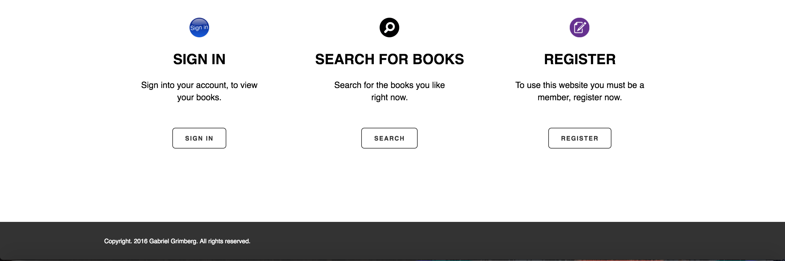

# Музыкальная библиотека

Цель этого задания — разработать веб-сайт для просмотра книг на тему музыки с использованием PHP и базы данных MySQL. 

### Скриншоты веб-сайта

#### Главная страница

#### Страница поиска

